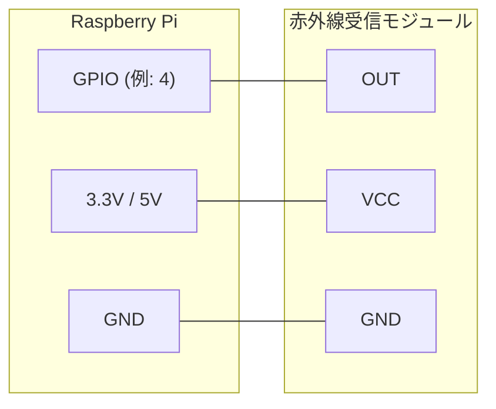
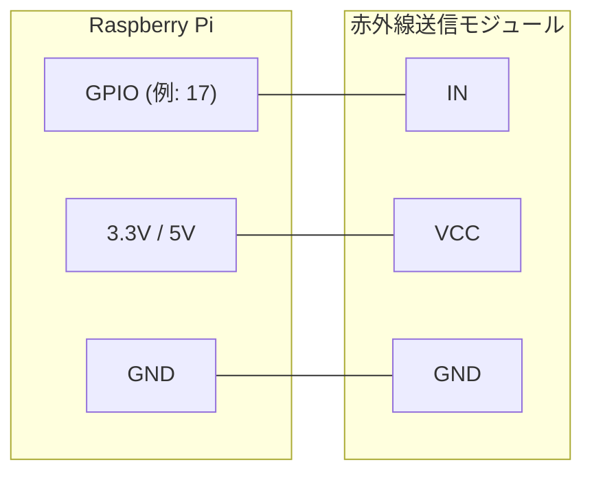
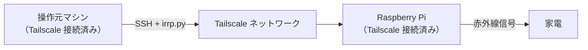

# remote-ir-device-controller

赤外線リモコンで操作される家電を遠隔操作するスクリプトのリポジトリ

## irrp.py

Raspberry Pi を使って赤外線リモコンから発せられる信号を記録・発信するツールです。

### 前提条件

- Raspberry Pi
- 赤外線受信モジュール（記録用）
- 赤外線送信モジュール（発信用）
- [pigpio](http://abyz.co.uk/rpi/pigpio/python.html) ライブラリ

```bash
pip install pigpio
```

pigpio デーモンを起動しておく必要があります。

```bash
sudo pigpiod
```

### 配線

#### 記録時（赤外線受信モジュール）



#### 発信時（赤外線送信モジュール）



> GPIO ピン番号は `-g` オプション（必須）で指定します。上記の番号はコマンド例で使われている値であり、固定ではありません。
> VCC の電圧は使用するモジュールの仕様に応じて 3.3V または 5V を選択してください。

### 使い方

#### 

赤外線受信モジュールを接続した GPIO ピンを `-g` で、保存先ファイルを `-f` で指定します。

```bash
./irrp.py -r -g4 -fcodes key1 key2 key3
```

実行すると各コードの名前ごとにキー入力を求められます。確認のため同じキーを 2 回押す必要があります。

#### 再生

赤外線送信モジュールを接続した GPIO ピンを `-g` で、コードが保存されたファイルを `-f` で指定します。

```bash
./irrp.py -p -g17 -fcodes key1 key2
```

### オプション

#### 共通

| オプション | 説明 |
|---|---|
| `-r`, `--record` | 記録モード |
| `-p`, `--play` | 発信モード |
| `-g`, `--gpio` | GPIO ピン番号（記録時: 受信、発信時: 送信） |
| `-f`, `--file` | コードの保存・読み込みファイル |
| `-v`, `--verbose` | 詳細ログを表示 |

#### 記録オプション

| オプション | デフォルト | 説明 |
|---|---|---|
| `--glitch` | 100 µs | これより短いエッジを無視する（グリッチフィルタ） |
| `--post` | 15 ms | 記録後の無信号状態を待つ時間 |
| `--pre` | 200 ms | 記録前の無信号状態を待つ時間 |
| `--short` | 10 | これより少ないパルスのコードを無効とする |
| `--tolerance` | 15% | 同一パルスとみなす誤差の許容範囲 |
| `--no-confirm` | - | 記録時の確認入力をスキップする |

#### 発信オプション

| オプション | デフォルト | 説明 |
|---|---|---|
| `--freq` | 38 kHz | 赤外線キャリア周波数 |
| `--gap` | 100 ms | 連続送信時のコード間の間隔 |

### Tailscale を使った遠隔操作

Tailscale を使うことで、同一ネットワーク外からでも Raspberry Pi に接続して信号を発信できます。

#### 1. Raspberry Pi に Tailscale をインストール

```bash
curl -fsSL https://tailscale.com/install.sh | sh
```

#### 2. Tailscale を起動して認証

```bash
sudo tailscale up
```

表示された URL をブラウザで開き、Tailscale アカウントでログインして認証します。

#### 3. Tailscale IP アドレスを確認

```bash
tailscale ip
```

#### 4. pigpiod を自動起動に設定

再起動後も pigpiod が自動で起動するよう systemd に登録します。

```bash
sudo systemctl enable pigpiod
sudo systemctl start pigpiod
```

#### 5. 操作元マシンから SSH 経由で信号を発信

操作元マシンも Tailscale に接続した上で、以下のように実行します。

```bash
ssh <user>@<tailscale-ip> "./irrp.py -p -g17 -fcodes key1"
```

`<user>` は Raspberry Pi のユーザー名、`<tailscale-ip>` は手順 3 で確認した IP アドレスです。

#### Tailscale 接続の概要


